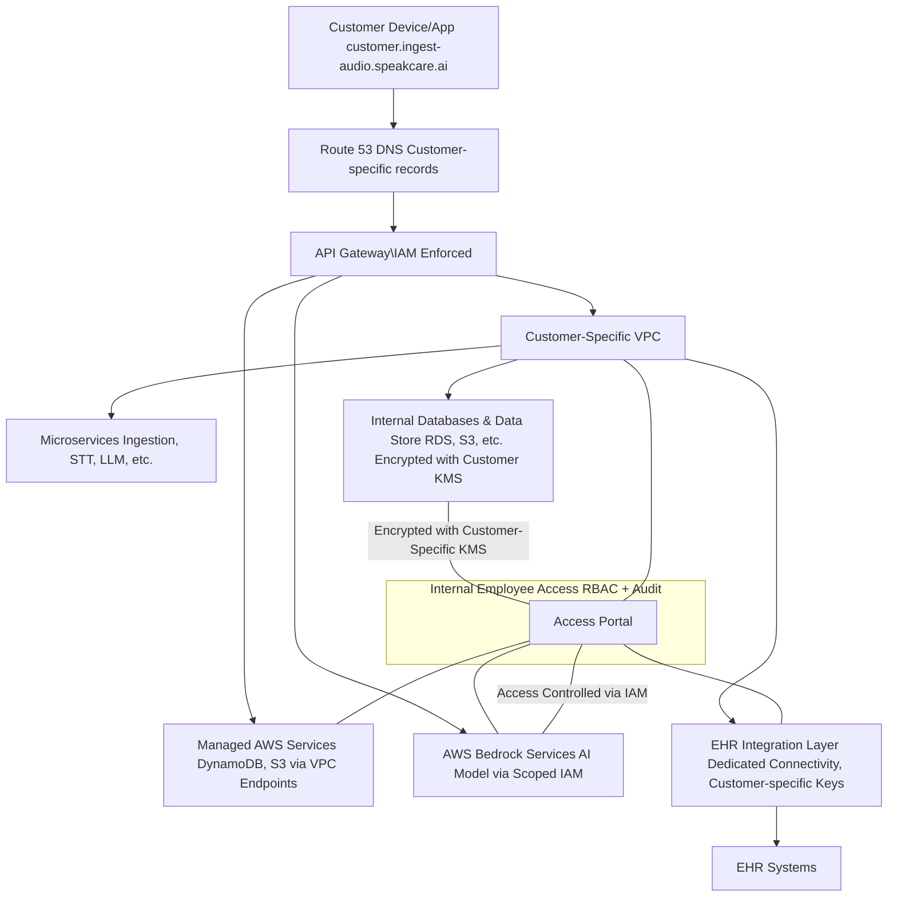

```mermaid
flowchart TD
    A[Customer Device/App customer.ingest-audio.speakcare.ai]
    B[Route 53 DNS Customer-specific records]
    C[API Gateway\IAM Enforced]
    D[Customer-Specific VPC]
    E[Microservices Ingestion, STT, LLM, etc.]
    F[Internal Databases & Data Store RDS, S3, etc. Encrypted with Customer KMS]
    G[Managed AWS Services DynamoDB, S3 via VPC Endpoints]
    H[AWS Bedrock Services AI Model via Scoped IAM]
    I[EHR Integration Layer Dedicated Connectivity, Customer-specific Keys]
    J[EHR Systems]

    %% Client Flow
    A --> B
    B --> C

    %% API to Customer VPC and Managed Services
    C --> D
    C --> G
    C --> H
    D --> E
    D --> F
    D --> I
    I --> J

    %% Internal Employee Access by strict RBAC with auditing
    subgraph Internal_Employee_Access [Internal Employee Access RBAC + Audit]
        K[Access Portal]
    end
    K --- D
    K --- G
    K --- H
    K --- I

    %% Annotations for Encryption and KMS
    F ---|Encrypted with Customer-Specific KMS| K
    H ---|Access Controlled via IAM| K
```